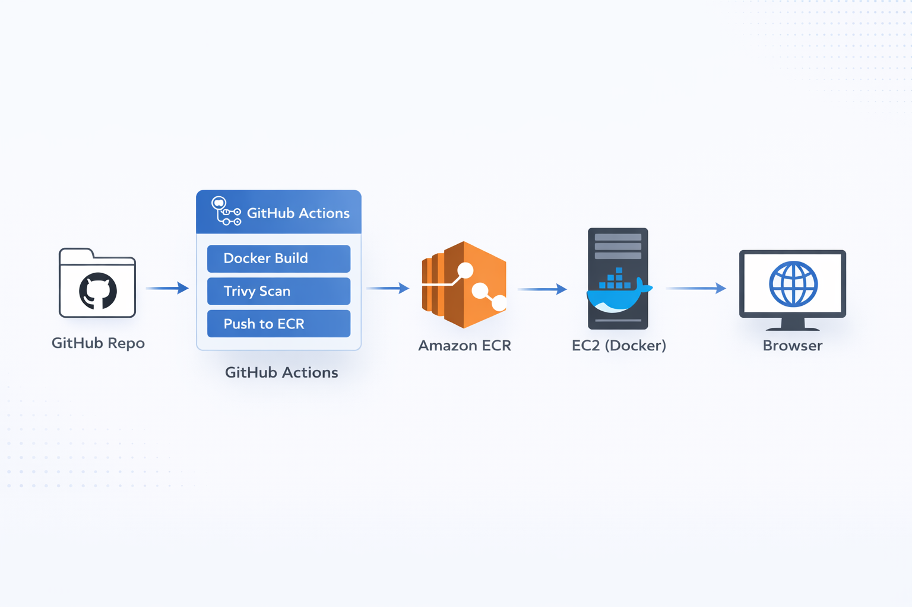

> ℹ️ **Note:** The CI/CD badge may show as failing when the EC2 instance is intentionally powered off to avoid cloud costs. The pipeline has been fully validated with successful deployments.


# Mini CI/CD Demo – Secure Docker Deployment on AWS

## 📌 Project Summary

This project demonstrates a **real-world, production-style CI/CD pipeline** for deploying a containerized Node.js application on AWS.

The pipeline automatically:
- Builds a Docker image
- Scans the image for vulnerabilities
- Pushes the image to Amazon ECR
- Deploys the container to an EC2 instance
- Supports rollback on deployment failure

This repository is designed as a **portfolio-grade DevOps demo,** suitable for freelance work, client projects, and technical interviews.

---

## 🛠 Tech Stack

- **Application**: Node.js (Express)
- **CI/CD**: GitHub Actions
- **Containerization**: Docker
- **Container Registry**: Amazon ECR
- **Deployment Target**: Amazon EC2
- **Security Scanning**: Trivy
- **Web Server**: Dockerized Node.js app
- **Cloud Provider**: AWS

---

## 🏗 Architecture Overview



### Flow:
1. Developer pushes code to GitHub
2. GitHub Actions triggers the CI/CD pipeline
3. Docker image is built
4. Image is scanned with Trivy
5. Image is pushed to Amazon ECR
6. EC2 pulls the latest image and runs the container
7. Application is accessible via browser

---

## 🔁 CI/CD Pipeline Breakdown

### 1️⃣ Build & Push
- Builds Docker image
- Tags image with `latest` and commit SHA
- Pushes image to Amazon ECR

### 2️⃣ Security Scan
- Trivy scans Docker image
- Informational scan for HIGH & CRITICAL
- Gate scan blocks only CRITICAL vulnerabilities
- Scan reports exported as GitHub artifacts

### 3️⃣ Deploy & Rollback
- Pulls latest image from ECR
- Stops existing container safely
- Starts new container
- Automatically rolls back if deployment fails

### 4️⃣ Concurrency Control
- Prevents overlapping deployments
- Cancels in-progress deploys if a new push occurs

---
🔐 Security Strategy
This project uses a balanced security approach commonly used in production

| Severity | Action                |
| -------- | --------------------- |
| HIGH     | Logged for visibility |
| CRITICAL | Blocks deployment     |

This ensures strong security without slowing delivery.
---

## 🚀 Deployment & Rollback Logic

- Deployment occurs over SSH to EC2
- Existing container image digest is saved
- If the new container fails:
- Previous image is restored automatically
- Service downtime is minimized

This simulates **real production rollback behavior**.

---

## ▶️ Run Locally

```bash
docker build -t mini-cicd-demo .
docker run -p 3000:3000 mini-cicd-demo

Visit
http://localhost:3000

